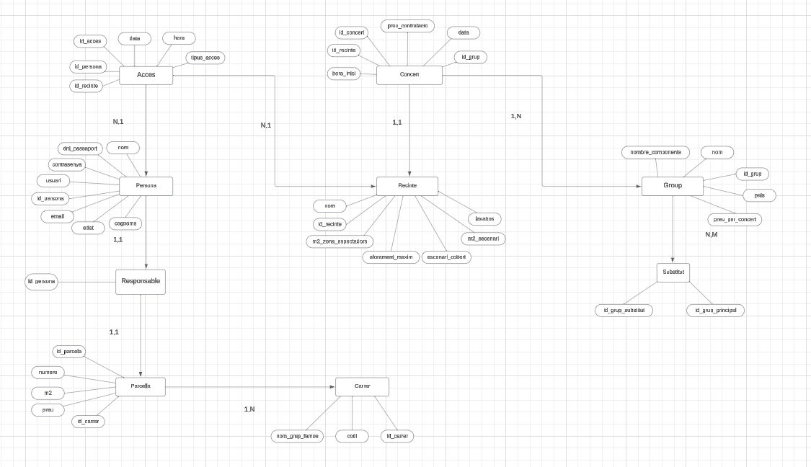
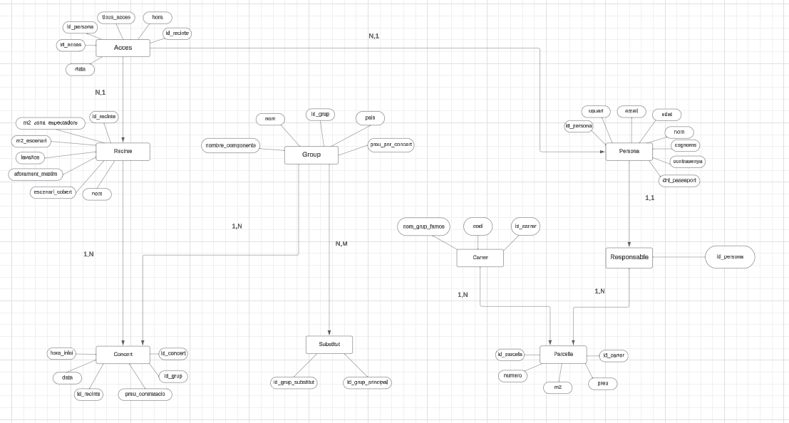

## ACTIVITAT - Disseny DDBB
# Luis Montiel

Por empezar en esta pratica he hecho un diseño de DDBB de entidad - relacion, en este caso he hecho 2 porque lo interprete de 2 maneras siguentes para no equivocarme en la actividad. 

# Primer Draw.io Modelo Relacional.

Recinte: Representa cada recinto del festival donde se realizan los conciertos. Incluye información como el nombre, los metros cuadrados del escenario, la capacidad máxima, y si dispone de baños o está cubierto.

Concert: Detalla cada concierto programado. Almacena el grupo que actúa, la hora de inicio y fin, y el precio acordado. Cada concierto se asocia a un recinto.

Grup: Representa a los grupos musicales que participan en el festival. Incluye su nombre, país de origen, número de componentes y tarifa base. También tiene relación con posibles sustitutos en caso de cancelación.

Persona: Almacena los datos de las personas registradas para asistir al festival, como su documento de identidad, usuario, email y contraseña.

Responsable: Indica quién es responsable del alquiler de una parcela en la zona de acampada. Cada responsable puede alquilar solo una parcela.

Parcela: Representa cada parcela disponible en la zona de acampada. Contiene el identificador de la parcela, tamaño en metros cuadrados y precio de alquiler.

Carrers: Representa las calles dentro de la zona de acampada, donde se agrupan las parcelas. Cada calle tiene un nombre (generalmente de un grupo famoso) y un código único.

Acces: Registra cada acceso de una persona a un recinto, incluyendo la fecha y hora. Una persona puede entrar y salir múltiples veces de los recintos del festival.

 

# Segundo Draw.io Modelo Relacional.

Recinte: Representa cada recinto del festival donde se realizan los conciertos. Almacena información como el nombre del recinto, tamaño del escenario, tamaño de la zona de espectadores, capacidad máxima, si tiene baños y si el escenario está cubierto.

Concert: Detalla cada concierto programado en el festival. Incluye datos como la fecha, hora de inicio, hora de finalización, precio acordado y el grupo musical que se presenta. Está relacionado con un recinto específico.

Group: Representa a los grupos musicales que participan en el festival. Incluye el nombre, país de origen, número de integrantes y el precio por concierto. También permite identificar posibles sustitutos en caso de que el grupo no pueda actuar.

Persona: Almacena los datos de cada persona registrada para asistir al festival, incluyendo identificador, usuario, contraseña, documento de identidad, email, nombre y apellidos.

Responsable: Indica a las personas responsables de alquilar una parcela en la zona de acampada. Cada responsable puede alquilar una única parcela.

Parcela: Representa cada parcela disponible en la zona de acampada. Incluye el número de parcela, tamaño en metros cuadrados, precio y la calle en la que se encuentra ubicada.

Carrers: Representa las calles dentro de la zona de acampada, donde se agrupan las parcelas. Cada calle tiene un código y un nombre (inspirado en un grupo famoso).

Acces: Registra cada acceso de una persona a un recinto del festival, incluyendo la fecha y hora. Esto permite saber cuándo una persona entra y sale de un recinto.

Substitut: Permite gestionar las relaciones de sustitución entre grupos musicales, especificando qué grupos pueden actuar como sustitutos en caso de que otro grupo no pueda presentarse.

 
# disseny_DDBB
